# Trip Quest 🐼

A pixel-art board game that doubles as a travel journal for the Chongqing → Chengdu
mother-daughter trip.

- **Timeline**: a horizontal side-scrolling world (endless-runner style). START → 30
checkpoints (10 days × morning / afternoon / night) → GOAL, one signpost per checkpoint
and a banner at the start of each day. The sky shifts morning → afternoon → night, the
skyline changes from Chongqing towers to Chengdu bamboo, and the mother-daughter duo
walks to the next signpost each time you clear one (tap them to jump).
- **Locks**: only the next checkpoint can be cleared or skipped; later ones are view-only.
A day also can't be cleared before its date (China time). Settings → *Test mode* (only shown in builds with
`VITE_ENABLE_TEST_MODE=true`) turns
the date lock off so you can try the game before the trip. Only the most recently
cleared checkpoint can be undone; earlier ones can still be edited.
- **Scrolling**: drag the little train along the track under the world (or tap the track)
to scroll; numbered posts mark each day. Tap a day button (two rows of five) to centre
that day in the window.
- **Decisions**: each checkpoint offers the planned activity, optional alternatives
(e.g. Ciqikou, Dujiangyan, Sanxingdui, Wuhou Shrine), "Rest at the hotel", or
"Did something else", with directions and travel time. All text is English except
place names and food names, which are in Chinese (handy to show a taxi driver or point
at on a menu). Food names have a short English hint in brackets.
- **Journal**: mood hearts, notes, up to 3 photos per checkpoint (a swipeable strip), who wrote it. Browse it all in
the Journal book; export/import a JSON backup.
- **Game bits**: roll a die once per checkpoint for coins and a chance card (lucky break,
oops, or side quest), earn EXP and level up, and collect 12 stamps.
- **Two save modes**:
  - *This device only* (default) — saved in the browser's localStorage. Needs no setup.
  - *Synced trip* — both phones share one journal through Supabase, with live updates.

All sprites are original (drawn as character grids in `src/components/Pixel.tsx`).
Icons are generated from emoji at runtime: each one is converted to a 16×16 pixel grid with
flat colours and a dark outline, then drawn as SVG so it stays sharp on any screen. Because
they start from the device's emoji font, icons look slightly different on iPhone and Android. The look is inspired by
2D side-scrolling MMOs, but no assets from any existing game are used.

## Features at a glance

Screenshots are phone-sized (390×844) and taken from a test build with made-up journal entries, placeholder
photos and canned Panda answers, so they show the layout, not real trip content.

### The journey map

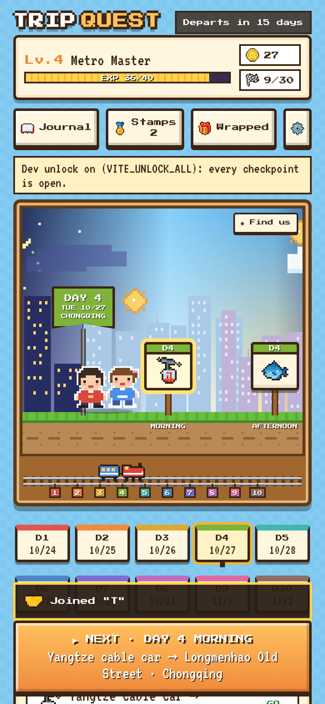

A side-scrolling pixel world from START to GOAL: 30 checkpoints (10 days × morning / afternoon / night).
The sky and skyline change as you go, the mother-daughter duo walks to the next signpost each time you clear
one, and the HUD shows level, coins, stamps, the Journal and Trip Wrapped buttons.

### Checkpoints: plan, journal and Panda Wishes

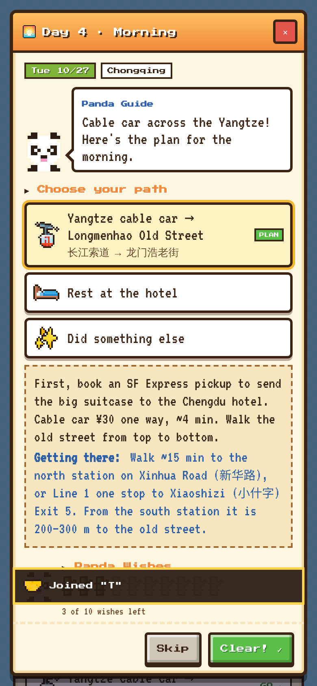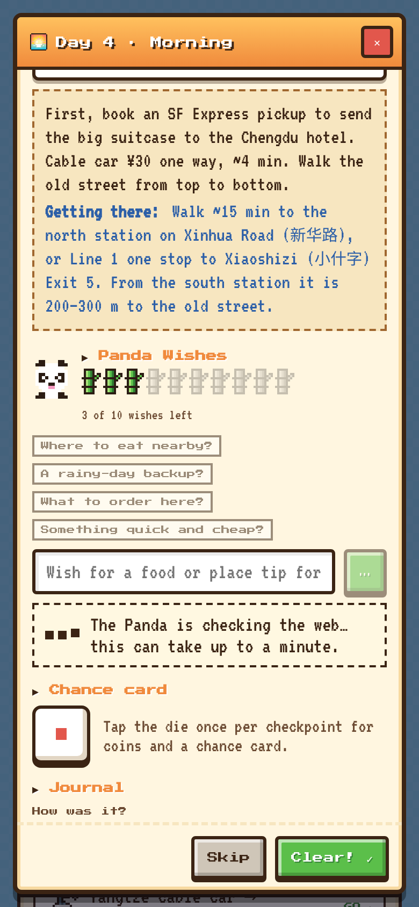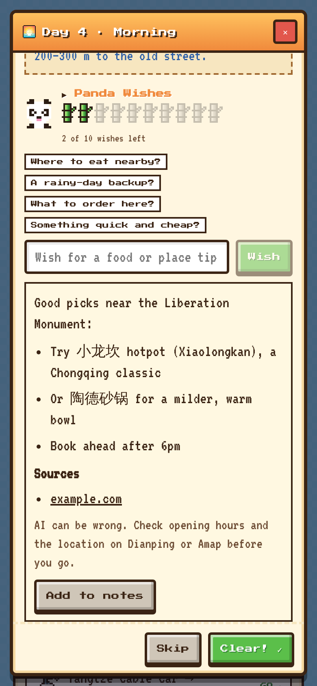

- Each checkpoint shows the planned activity, alternatives, "Rest at the hotel" and "Did something else", with
directions and travel time. Chinese place and food names are kept in Chinese (handy for taxi drivers and menus).
- **Panda Wishes** (optional, needs the `ask-guide` Supabase function): ask the Panda for a food or place tip. You
get a limited number of wishes per day, shown as bamboo shoots. While it searches, the Panda animates and a
loading box shows; answers come with source links and an "Add to notes" button.
It only appears on checkpoints that are still open.
- Journal: mood hearts, notes and up to 3 photos per checkpoint.


### Cleared and skipped checkpoints

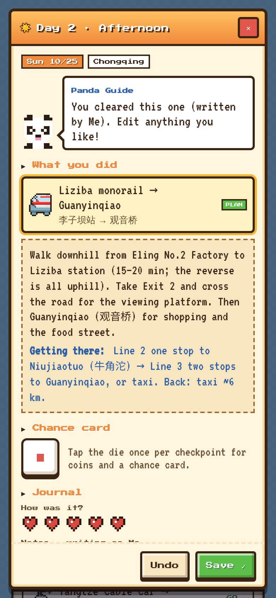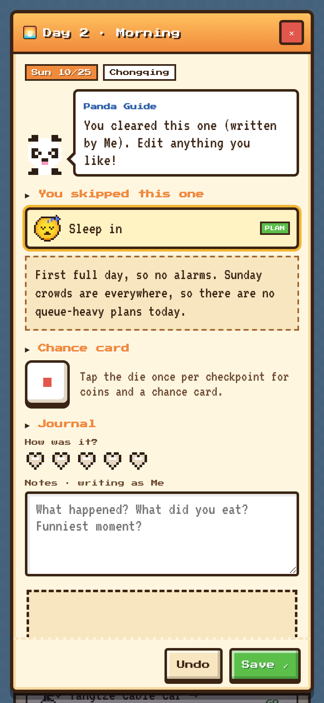

Once a checkpoint is cleared or skipped, the plan you picked is fixed. You can still edit the notes, hearts and
photos until the recap is made. Only the most recently cleared checkpoint can be undone.

### Trip Wrapped

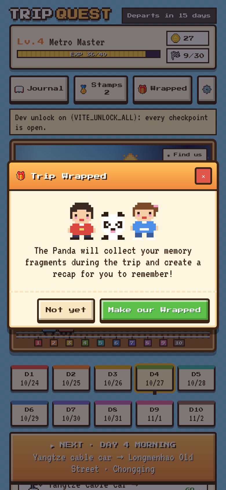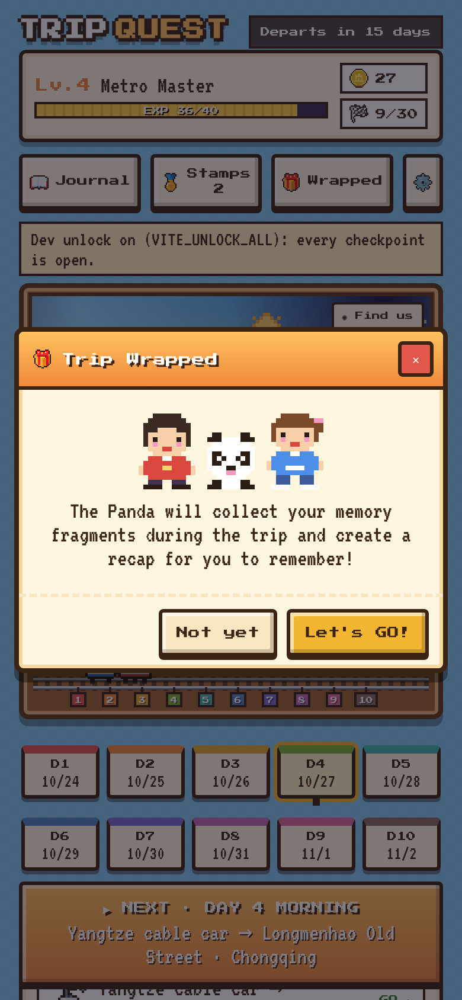

After the trip (or in Test mode) the Wrapped button lets you make a Spotify-Wrapped-style recap. Gemini reads the
notes and photos, and the recap is saved once, so it is the same on both phones.

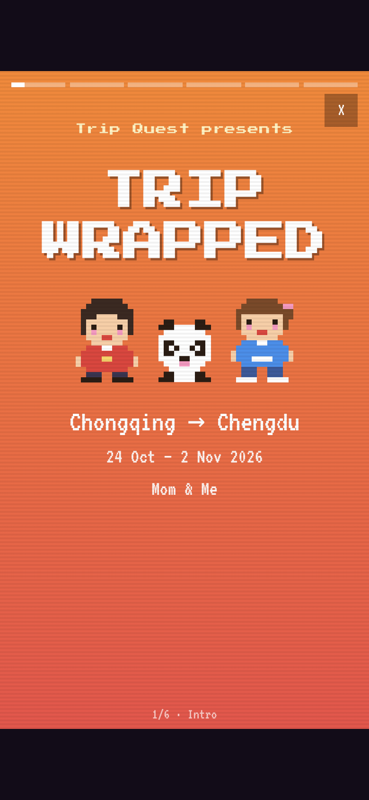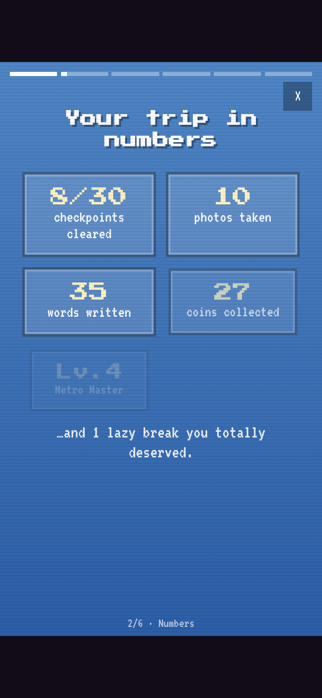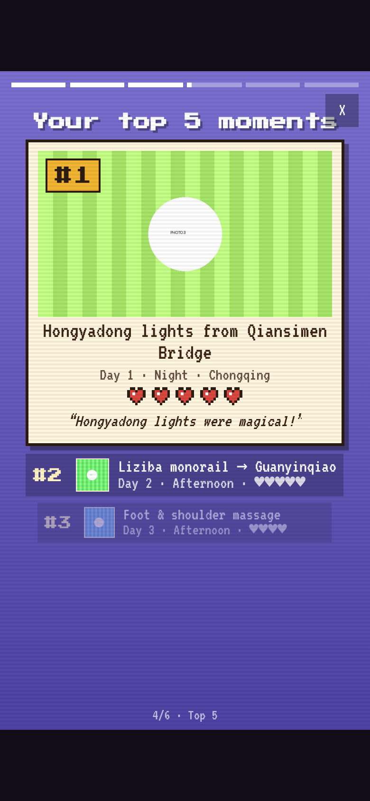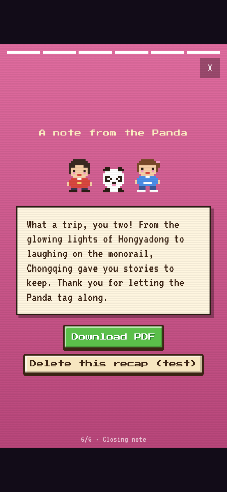

Six slides: intro, trip in numbers, best shots (photo montage), top 5 moments, travel personality, and a closing
note from the Panda with a **Download PDF** button. Tap right/left to move, hold to pause.

### After the recap is made

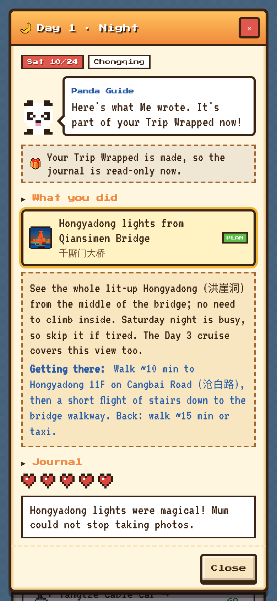

The journal becomes read-only (enforced in the database, not just the app), so the recap always matches what was
written.

### Settings and extras

- Two save modes: this device only, or a synced trip shared by both phones through Supabase.
- Photos, notes and mood hearts sync live between phones; export/import a JSON backup from the Journal.
- Roll a die once per checkpoint for coins and chance cards, earn EXP, collect 12 stamps.
- Retro sound effects (toggle in Settings).
- *Test mode: ignore dates* is only shown in builds with `VITE_ENABLE_TEST_MODE=true`.


## Run locally

```bash
npm install
npm run dev          # http://localhost:5173
npm run build        # type-check + production build into dist/
```

Requires Node 20+.

### Test mode and unlocking everything

Set `VITE_ENABLE_TEST_MODE=true` to show the *Test mode: ignore dates* switch in Settings (dates ignored, order lock kept).
Without it the switch is hidden and test mode is always off.

To unlock everything locally:

Create `.env.local` with:

```
VITE_UNLOCK_ALL=true
```

Restart `npm run dev`. Every checkpoint opens (no order or date lock) and any cleared
checkpoint can be undone. A banner shows when this is on. Don't set it in Vercel.

## Project layout

```
src/
  data/itinerary.ts   ← the trip plan (edit this to change activities, directions, dates)
  data/game.ts        ← chance cards, EXP/levels, stamps (pure functions of the entries)
  data/locks.ts       ← order lock + date lock rules
  lib/repo.ts         ← storage interface the UI talks to
  lib/localRepo.ts    ← localStorage implementation
  lib/cloudRepo.ts    ← Supabase implementation (anonymous auth + join code + realtime)
  lib/recap.ts        ← Trip Wrapped ranking, stats and montage picks (plain calculation)
  lib/recapPdf.ts     ← turns the Wrapped slides into a PDF on the phone
  components/         ← Timeline (side-scroller), QuestModal, Journal/Stamps/Settings panels, Recap, pixel sprites
supabase/schema.sql   ← tables, RLS policies, RPCs, photo bucket
supabase/functions/   ← ask-guide (Panda Wishes) and trip-recap (Trip Wrapped) Edge Functions
```


## Deploy to Vercel (local mode)

1. Push this folder to a GitHub repo.
2. On vercel.com → **Add New… → Project** → import the repo.
  Vercel detects Vite automatically (build `npm run build`, output `dist`).
3. Deploy. That's it — each phone keeps its own journal.


## Add Supabase sync (optional, free tier is plenty)

1. Create a project at supabase.com.
2. **SQL Editor → New query** → paste `supabase/schema.sql` → **Run**.
3. **Authentication → Sign In / Providers** → turn on **Allow anonymous sign-ins**.
4. **Project Settings → API Keys** (or the **Connect** button at the top): copy the *Project URL* and the
  *publishable key* (`sb_publishable_…`). Never use the `sb_secret_…` key in this app.
5. In Vercel → Project → **Settings → Environment Variables**, add:
  - `VITE_SUPABASE_URL` = Project URL
  - `VITE_SUPABASE_PUBLISHABLE_KEY` = publishable key (the older `VITE_SUPABASE_ANON_KEY` name also works)
   Then redeploy (Vite reads these at build time). For local dev, put the same two lines in
   `.env.local` (see `.env.example`).
6. Optional: set `VITE_REQUIRE_TRIP=true` (in `.env.local` and Vercel) to make the cloud trip mandatory. The game then
  shows a "Create a trip / Join with a code" screen first and never falls back to saving in the browser. If the
   Supabase keys are missing it says so instead of silently playing offline. "Leave trip" returns to that screen.
7. In the app: **⚙ Settings → Start a shared trip** on one phone (tick "Copy this phone's
  journal" to keep what you've written). It shows a 6-letter code. On the other phone:
   **Settings → Join with a code**.


### How the security works

- The publishable (anon) key is designed to be public; data is protected by Row Level Security.
- Each phone signs in anonymously (no email or password). Only members of a trip
(whoever created it or joined with its code) can read or write its entries and photos.
- Anyone who has the code can join, so treat the code like a private link.
- Anonymous sessions live in the browser. If a phone clears its site data, re-join
with the code; the journal itself stays in Supabase.
- Photos go to a private bucket (`journal-photos/<trip>/<checkpoint>/…`). They're
downscaled to 1280 px before upload and shown via signed URLs that expire after 1 hour.

The schema was tested against Postgres (PGlite) with Supabase-style stubs: members can
read and write, non-members get nothing, the join code works, and photo-folder access is
limited to members.

## Ask the Panda (Gemini tips, optional)

Each checkpoint can show a "Panda Wishes" box for food and place suggestions. Your party gets 10 wishes
(shown as stars) per day, shared across the trip; they refill at midnight China time, and a wish is refunded if the
guide fails. The browser never sees the
Gemini key: it calls a Supabase Edge Function (`supabase/functions/ask-guide`) that checks the player's login and
trip membership, spends one wish, then calls Gemini. By default it uses Google's
Antigravity agent with Google Search, which checks the web before answering. This is a preview feature
and can take up to a minute per question.

### Set it up (once)

1. **Get a Gemini API key.** Open [https://aistudio.google.com/apikey](https://aistudio.google.com/apikey), sign in with a Google account and click
  "Create API key". A Gemini app subscription is not needed (it does not include API access); the free tier is
   enough to start. Copy the key. Never paste it into the repo, `.env.local`, Vercel, chat or a screenshot.
2. **Run the wishes SQL.** In the Supabase dashboard open SQL Editor and run `supabase/schema.sql` (the "AI guide
  quota" part is what is new, including the star counter and refund functions; the file is safe to re-run). This step is manual because this repo keeps the schema
   in one pasted file, not in `supabase/migrations/`. See "Auto-deploying from GitHub" below to change that.
3. **Install the Supabase CLI** ([https://supabase.com/docs/guides/cli](https://supabase.com/docs/guides/cli)), then run these from the repo folder:
  ```bash
   supabase login
   supabase link --project-ref <your-project-ref>      # the part before .supabase.co in your project URL
   supabase secrets set GEMINI_API_KEY=<paste-your-key-here>
   supabase functions deploy ask-guide
  ```
   `supabase secrets set` stores the key inside Supabase, where only the function can read it.
4. **Turn the box on.** Set `VITE_ENABLE_GUIDE=true` in `.env.local` (and in Vercel, then redeploy).
5. **Check it.** Open a checkpoint in a synced trip and ask a question. If it fails, run
  `supabase functions logs ask-guide` (or open Edge Functions → ask-guide → Logs in the dashboard).

To replace a leaked or old key later, run `supabase secrets set GEMINI_API_KEY=<new-key>` again. No redeploy needed.

Optional secrets, set the same way: `GUIDE_DAILY_LIMIT` (wishes per trip per day, default 10; if you set it earlier, delete it to use 10) and
`GUIDE_GROUNDING` (`agent`, `search` or `none`, see below). The models used are set in
`supabase/functions/ask-guide/` (`index.ts` and `guide.ts`) and can be overridden with `GEMINI_MODEL` and `GUIDE_AGENT_MODEL`.

### Things to know

- Only the plan text and the question are sent to Gemini. Journal notes and photos are never sent.
- On Google's free tier, prompts may be used to improve Google products. Paid tier does not.
- Without search, Gemini can invent places or get details wrong. The prompt tells it to stay with well-known places
and never give hours or prices, and the box reminds players to check Dianping or Amap.
- `GUIDE_GROUNDING=agent` **(default):** Google's Antigravity agent preview with only Google Search allowed (no code
execution or page fetching). On the free tier AI Studio shows 100 requests/day and 60/minute for it, plus a separate
Search allowance. It is slower than a plain model call, and Google has not documented where its source links appear,
so source links may be missing. If Google refuses the call, the function retries without any tool and the box says
the answer was not checked. Check the AI Studio rate-limit page for your own numbers.
- `GUIDE_GROUNDING=search`**:** Google Search on a normal Gemini model. Google gives Search no free allowance on its newer
models, so it returns a 429 unless billing is enabled on the key's Google Cloud project.
- `GUIDE_GROUNDING=none`**:** answers come from the model's memory only and can invent places or details. The prompt
tells it to stay with well-known places and never give hours or prices.
- Always check opening hours and the location on Dianping or Amap before you go.
- Free-tier limits differ per model and can change. Check your own at [https://aistudio.google.com/rate-limit](https://aistudio.google.com/rate-limit).
- Run the function locally: copy `supabase/functions/.env.example` to `supabase/functions/.env`, then
`supabase functions serve ask-guide --env-file supabase/functions/.env`.


### Auto-deploying from GitHub (optional)

Supabase can deploy for you on every push, but it only picks up changes in the standard layout:
SQL files in `supabase/migrations/` (one timestamped file per change) and functions listed in
`supabase/config.toml`. Two ways to set it up:

- **Supabase's GitHub integration** (Dashboard → Project Settings → Integrations → GitHub): turn on
"Deploy to production" and pushes to your main branch apply new migrations and deploy functions.
- **A GitHub Action** that runs `supabase link`, `supabase db push` and `supabase functions deploy`. It needs
the GitHub secrets `SUPABASE_ACCESS_TOKEN`, `SUPABASE_DB_PASSWORD` and your project id.

Secrets such as `GEMINI_API_KEY` are never deployed from the repo, so step 3's `supabase secrets set` stays a
one-time manual step either way.

## Trip Wrapped (end-of-trip recap, optional)

A Spotify-Wrapped-style recap: 6 story slides you tap through, and a **Download PDF** button on the last one.

1. Intro · 2. Your trip in numbers · 3. Your best shots (5 photos) · 4. Your top 5 moments ·
2. Your travel personality · 6. A closing note from the Panda + Download PDF

**How it's made.** The 🎁 Wrapped button appears in the top bar after the last checkpoint, after 2 Nov
(China time), or any time in Test mode. Tapping "Make our Wrapped":

1. The `trip-recap` Edge Function sends each cleared checkpoint's note, hearts and photos (up to 3) to Gemini,
  which returns the note's mood (−1 to 1), up to 3 feelings, a short quote copied from the note (checked to be
   really in it), a caption and a score for each photo (happy faces, wow, sharpness). Each result is saved in
   `recap_moments` and never asked for again.
2. The game ranks the moments: 40% your hearts, 25% the note's mood, 25% the best photo, 10% effort (photos
  and words added). The montage takes the 5 best photos that aren't already in the top 5.
3. Gemini writes the personality title, its description and the closing note from those facts.
4. The finished recap is saved once in `recaps`. **From then on the journal is read-only for both phones**
  (the database refuses entry and photo changes). Both phones always see the same recap.

**Set it up:** it uses the same `GEMINI_API_KEY` secret and `VITE_ENABLE_GUIDE=true` switch as Panda Wishes. Then:

```bash
# 1. In the Supabase SQL Editor, run supabase/schema.sql again (adds recap_moments, recaps and the journal lock).
# 2. Deploy the function:
supabase functions deploy trip-recap
```

Optional secret: `RECAP_MODEL` to use a different Gemini model for the recap (default: the same as `GEMINI_MODEL`).

**Things to know**

- Notes and photos of the cleared checkpoints are sent to Google. On a paid (billing-enabled) Gemini key, Google
doesn't use them to improve its products; on the free tier it may.
- Cost is small: about 30 calls with up to 90 resized photos, roughly US$0.10 or less on Gemini Flash-Lite's paid
price. That is an estimate, not a measured run.
- In Test mode (or with `VITE_UNLOCK_ALL`), the last slide also shows "Delete this recap (test)", which removes the
recap and its saved analysis and unlocks the journal again, so a test run before the trip doesn't block the real one.
- The PDF is made on the phone (nothing is uploaded): 6 portrait pages, about 1 MB with photos.


## Known limits

- In local mode, photos are stored as small (640 px) JPEGs in localStorage. Browsers allow
roughly 5 MB per site, so about 50–100 photos fit (up to 3 per checkpoint, 90 in a full trip). Use cloud sync for more.
- Fonts load from Google Fonts (Press Start 2P, VT323). Offline, the app falls back to
system fonts.
- Realtime sync covers new and edited entries. If one phone *undoes* a checkpoint, the
other phone sees it on the next reload, because Supabase filtered realtime channels don't
deliver deletes.
- "Today" is calculated in China time (Asia/Shanghai).


## Ideas for later

- Add a PWA manifest so it can be installed to the home screen and work offline.

